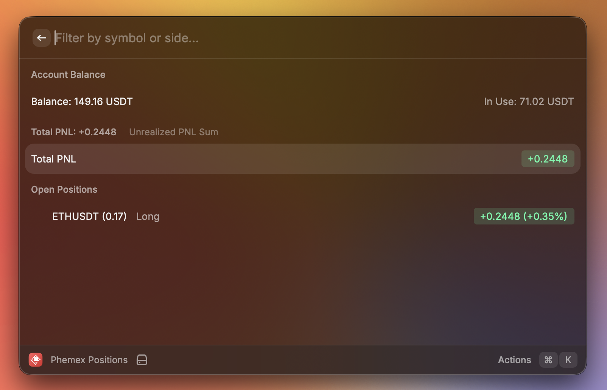
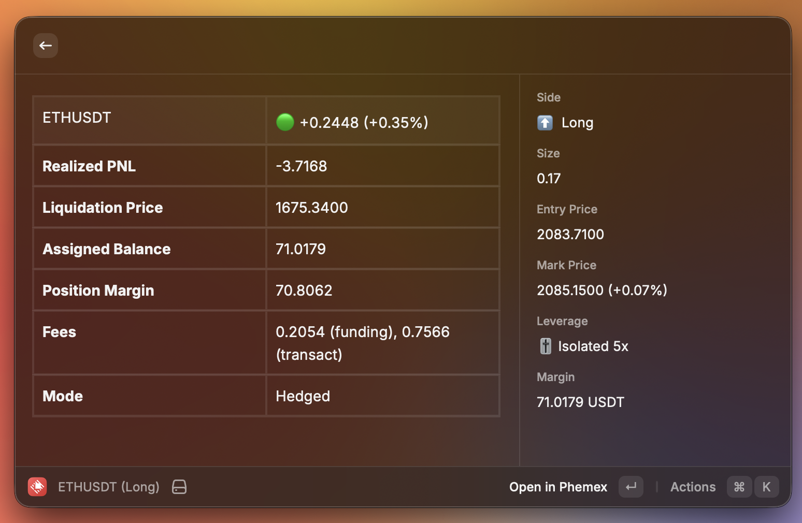

# Phemex Futures Positions

Raycast extension to view your open futures positions on Phemex exchange.

## Features

- View all open futures positions at a glance
- Real-time PNL (Profit and Loss) tracking
- Account balance overview
- Detailed position view with entry price, mark price, leverage, and liquidation price
- Quick access to Phemex trading interface

## Screenshots





## Setup

### 1. Get API Credentials

1. Log in to your [Phemex account](https://phemex.com)
2. Go to **Account** → **API Management** (or visit directly: https://phemex.com/account/api-management)
3. Click **Create New API Key**
4. Select permissions:
   - ✅ **Read** (required for viewing positions)
   - ❌ **Trade** (not required)
   - ❌ **Withdraw** (not required)
5. Complete the security verification (2FA)
6. Copy your **API Key** and **API Secret** (save the secret - it's shown only once)

### 2. Configure Extension

1. Open Raycast Preferences (`Cmd + ,`)
2. Navigate to Extensions → Phemex Positions
3. Paste your **API Key** and **API Secret**

### 3. Use

Open Raycast and type "Phemex Positions" to see your open positions.

## Security

- API credentials are stored securely in Raycast's encrypted preferences
- API keys are not shared or transmitted anywhere except to Phemex's official API
- The extension only requires **read** permissions

## Development

```bash
npm install
npm run build
npm run dev
```

## License

MIT
